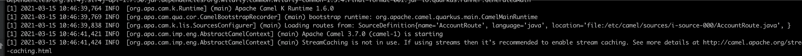
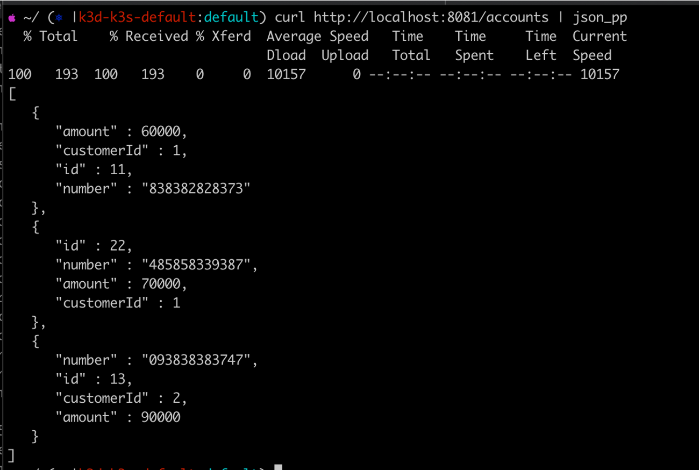
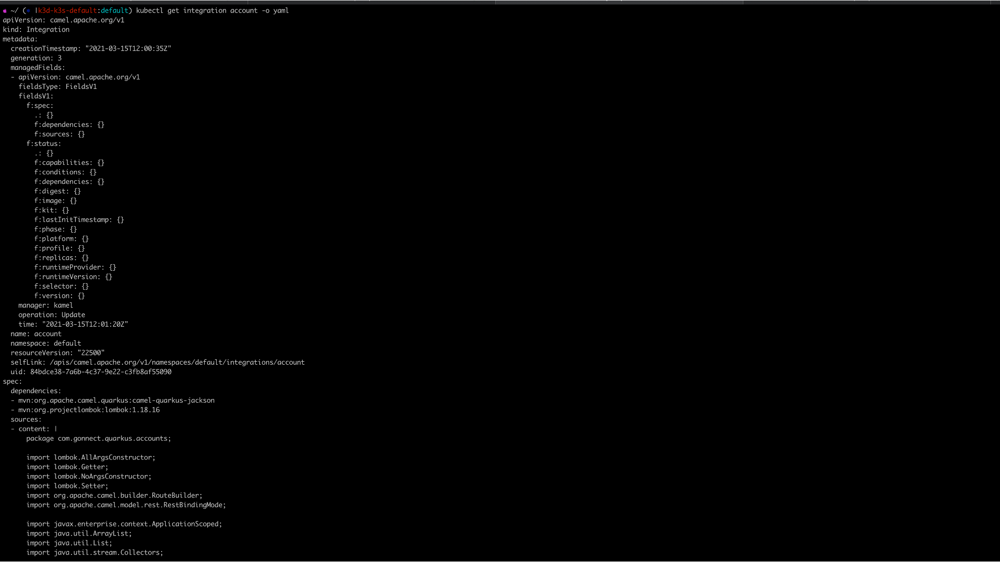

# Quarkus Apache Camel-K

In a nutshell, apache camel-k is:

   ````
   Apache Camel-K  = Apache Camel + K8s
   ````

Apache camel-k provides powerful integration pattern along with serverless capabilities on k8s. Quarkus is a full-stack,
k8s-native, Java Application Framework tailored for OpenJDK HotSpot and GraalVM. As compared, to other frameworks, such
as Spring, it offers small memory footprint and reduced boot time. It supports combination of both imperative code and
non-blocking reactive style.

In this blog, I will build classical account service using quarkus + camel-k

# Pre-requisite

- k3d (micro k8s)
- apache camel-k on k8s
  ````
    kamel install --registry docker.io --organization <username> --registry-auth-username <username> --registry-auth-password <password>
    ````
- kamel cli

# Play time

- Run by using following command:

````
kamel run --name account --dev \
   src/main/java/com/gonnect/quarkus/accounts/AccountRoute.java \
   --save
````

- verify below logs:



- port forward port 80 to 8081 and issue the following curl command:

````
   curl http://localhost:8081/account
````



NOTE:

In the background, Apache Camel K creates the CRD Integration, which can viewed using following command:

````
kubectl get integration account -o yaml
````

